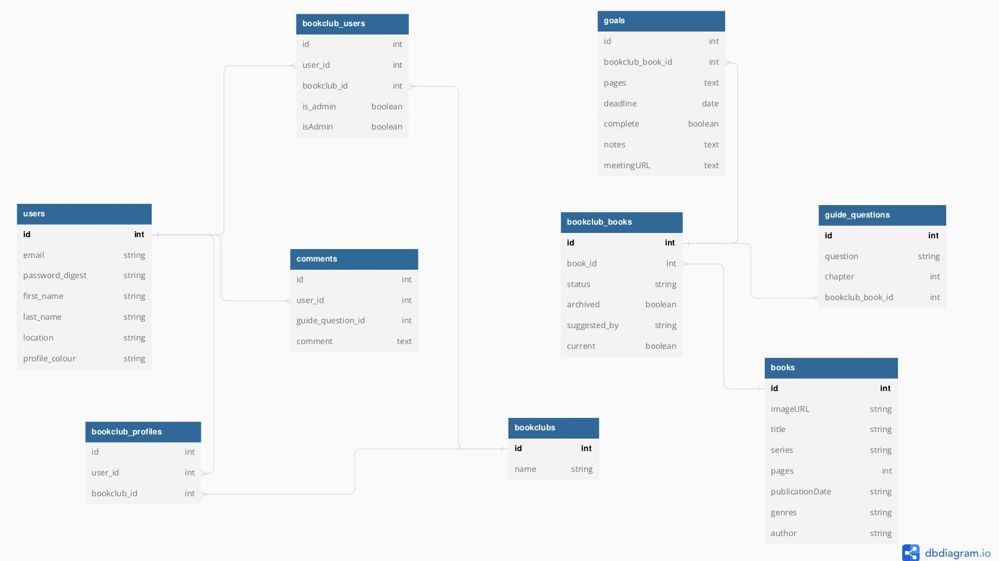

# Page Turners API

This is a simple web API for creating and managing book clubs. The API allows users to create, read, update, and delete book clubs. The app is built using Ruby on Rails and Sqlite3, and is designed to be easily integrated into its frontend counterpart. Its main purpose is to provide a centralized tool for managing book clubs, making it easier for administrators to organize events and communicate with other people about books.

## Getting Started

## Installation

- To get started, clone the repository and navigate to the project directory:

        git clone git@github.com:zac717/phase_4_group_project.git

        cd phase_4_group_project

- Then, install the required dependencies using Bundler:

        bundle install 

- Tun the migrations

        rails db:migrate 

## Usage

- Start the server with

        rails server 

## Technologies used

- Ruby on Rails
- Visual Studio Code
- Sqlite3
- Bcrypt

## Table

## Endpoints

## Users Endpoints

The Book Clubs API provides the following endpoints:

### POST /users

This endpoint creates a new user. The request body is a JSON object with the following properties:

- first_name: The user's first name
- last_name: The user's last name
- email: The user's email address
- password: The user's password
- password_confirmation: User's password confirmation
- bookclub: User's created bookclub
- location: User's location
- profile_colour: User's preferred colour

The response body is an object representing the newly created user, with those properties, plus a unique identifier.

### GET /users/:id

This endpoint returns a single user, identified by the id parameter in the URL. The response body is an object representing the user, with the following properties:

- first_name: The user's first name
- last_name: The user's last name
- email: The user's email address
- password: The user's password
- password_confirmation: User's password confirmation
- bookclub: User's created bookclub
- location: User's location
- profile_colour: User's preferred colour

The response body is an object representing the user, with those properties.

### PUT /users/:id

This endpoint updates an existing user, identified by the id parameter in the URL. The request body should be a JSON object with the following properties:

- first_name: The user's first name
- last_name: The user's last name
- email: The user's email address
- password: The user's password
- password_confirmation: User's password confirmation
- bookclub: User's created bookclub
- location: User's location
- profile_colour: User's preferred colour

The response body is an object representing the newly updated user, with those properties, plus a unique identifier.

### DELETE /users/:id

This endpoint deletes an existing user, identified by the id parameter in the URL.

## Book Clubs Endpoints

### POST /bookclubs

This endpoint creates a new book club. The request body should be a JSON object with the following properties:

- id: The unique identifier for the book club.
- name: The name of the book club

The response body is an object representing the newly created bookclub, with those properties, plus a unique identifier.

### GET /bookclubs

This endpoint retrieves all book clubs. The response body is an array of book club objects, each with the following properties:

- id: The unique identifier for the book club.
- name: The name of the book club.

The response body is an array representing the details, with those properties.

### GET /bookclubs/:id

This endpoint retrieves a single book club, identified by the id parameter in the URL. The response body is an object representing the book club, with the same properties as the objects returned by the /bookclubs endpoint.

The response body is an object representing the details, with those properties.

### PUT /bookclubs/:id

This endpoint updates an existing book club, identified by the id parameter in the URL. The request body should be a JSON object with the following properties:

- name: The new name for the book club.

The response body is an object representing the updated book club, with the same properties as the objects returned by the /bookclubs/:id endpoint, plus a the identifier.

### DELETE /bookclubs/:id

This endpoint deletes an existing book club, identified by the id parameter in the URL.

### PUT /bookclubs/:id/current_book

This custom endpoint sets the current book for a book club, identified by the id parameter in the URL. The request body should be a JSON object with the following property:

- book_id: The ID of the book to set as the current book.

The response body is an object representing the updated book club, with the same properties as the objects returned by the /bookclubs/:id endpoint, plus a unique identifier.

## Goal Endpoints

### POST /goals

This endpoint creates a new goal. The request body should be a JSON object with the following properties:

- description: The description of the goal.
- deadline: The due date of the goal
- complete: Whether the goal has been completed or not (optional).
- pages: No. of pages to read.
- notes: Writes that come one posts.
- meetingURL: Meeting link for a discussion.

The response body is an object representing the newly created goal, with those properties plus a unique identifier.

### GET /goals/:id

This endpoint retrieves a single goal, identified by the id parameter in the URL. The response body is an object representing the goal, with the following properties:

- description: The description of the goal.
- deadline: The due date of the goal
- complete: Whether the goal has been completed or not (optional).
- pages: No. of pages to read.
- notes: Writes that come one posts.
- meetingURL: Meeting link for a discussion.

The response body is an object representing the details of the, with those properties plus a unique identifier.

### PUT /goals/:id

This endpoint updates an existing goal, identified by the id parameter in the URL. The request body should be a JSON object with the following properties:

- name: The name of the goal.
- description: The description of the goal.
- due_date: The due date of the goal.
- completed: Whether the goal has been completed or not.

The response body is an object representing the updated goal, with the same properties as the objects returned by the /goals/:id endpoint.

### DELETE /goals/:id

- This endpoint deletes an existing goal, identified by the id parameter in the URL.

## Guide Questions and Comments

### GET /guide-questions/:id

This endpoint retrieves a single guide question, identified by the id parameter in the URL. The response body is an object representing the goal, with the following properties:

- id: The unique identifier for the guide question.
- question: The text of the guide question.
- chapter: Chapter that is up for a discussion.

The response body is an object representing the details of the, with those properties plus a unique identifier.

### POST /guide-questions

This endpoint creates a new guide question. The request body should be a JSON object with the following properties:

- question: The text of the guide question.
- chapter: Chapter that is up for a discussion.

The response body is an object representing the newly created guide question, with the following properties:

- id: The unique identifier for the guide question.
- question: The text of the guide question.
- chapter: Chapter that is up for a discussion.

### DELETE /guide-questions/:id

This endpoint deletes an existing guide question, identified by the id parameter in the URL.

### PUT /guide-questions/:id

This endpoint updates an existing guide question, identified by the id parameter in the URL. The request body should be a JSON object with the following properties:

- question: The text of the guide question.
- chapter: Chapter that is up for a discussion.

The response body is an object representing the updated guide question, with the same properties as the objects returned by the /guide-questions/:id endpoint.

## Comments Endpoints

### POST /comments

This endpoint creates a new comment. The request body should be a JSON object with the following properties:

- comment: The text of the comment.
- user_id: The ID of the user who created the comment.
- guide_question_id: The ID of the guide question to which the comment belongs.

The response body is an object representing the newly created comment, with the following properties:

id: The unique identifier for the comment.

- comment: The text of the comment.
- user_id: The ID of the user who created the comment.
- guide_question_id: The ID of the guide question to which the comment belongs.

### DELETE /comments/:id

This endpoint deletes an existing comment, identified by the id parameter in the URL.
